# 프로젝트 '무비플레이리스트'

## 🗓️프로젝트 개요

</img></img></img></img>

- **진행 기간 : 2022.05.18 ~ 2022.05.27 오전 9시 (9일간)**
- **목표** 
  - 검색을 통한 영화추천 웹서비스를 개발합니다.
  - 사용자에게 영화 관련 다양한 경험을 제공합니다.

## 👯팀원 정보 및 업무 분담 내역

김혜린 - 화면 설계서 제작 및 컴포넌트 설계, OST, 영화 명대사 데이터 수집 및 정제, Front-END 개발 및 UI, UX 개선

김찬영 - 영화 데이터 수집 및 정제, 추천 알고리즘 개발, ERD 설계, DB 구출 및 Back-End 개발

## 📹시연 영상(유튜브 링크)

https://youtu.be/rruaTwDmHhc

## 🪟 서비스 구현 화면

### 홈 화면

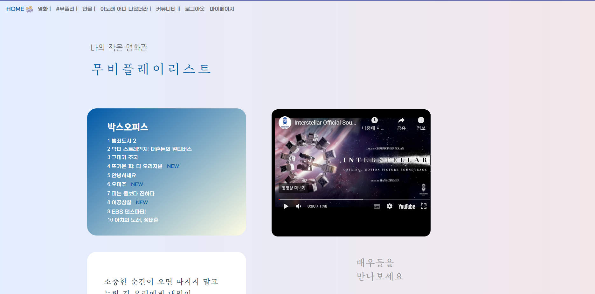

###  영화 메뉴

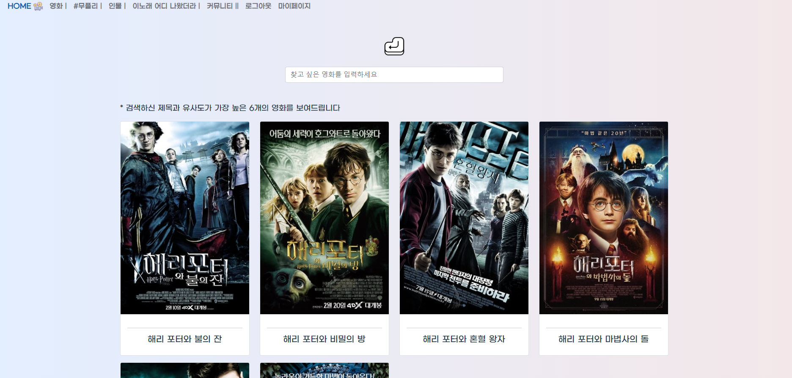

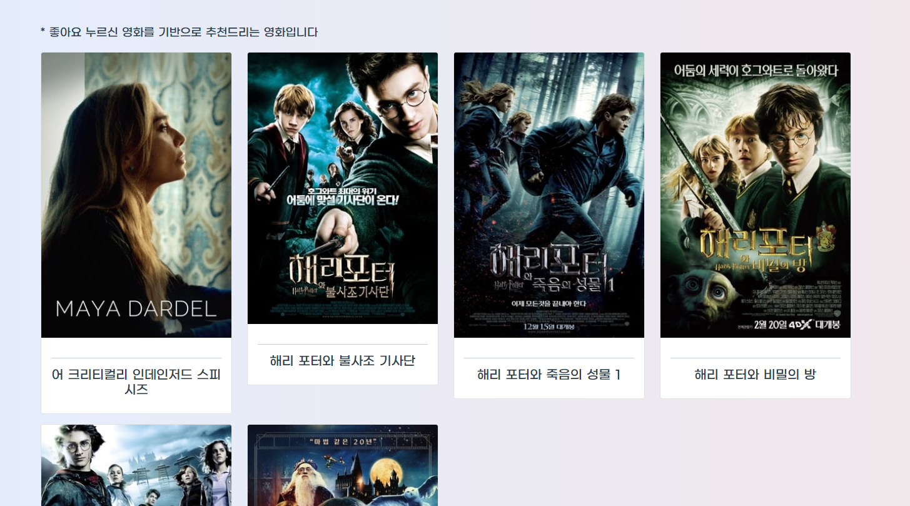

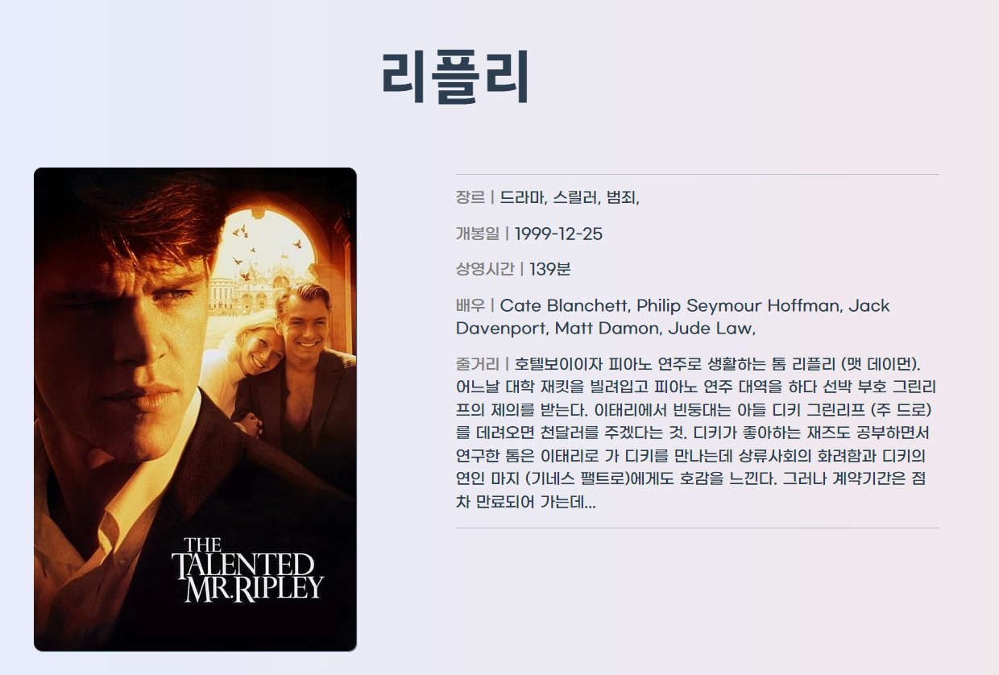

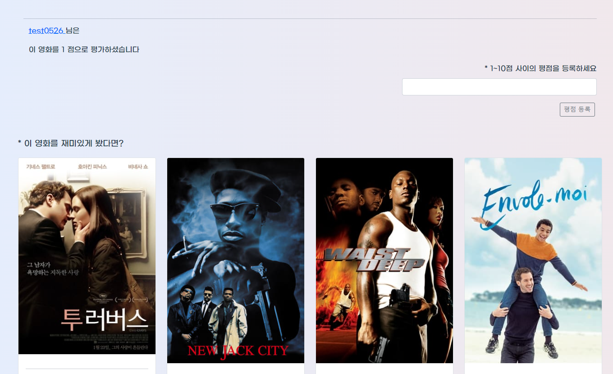

### 무플리

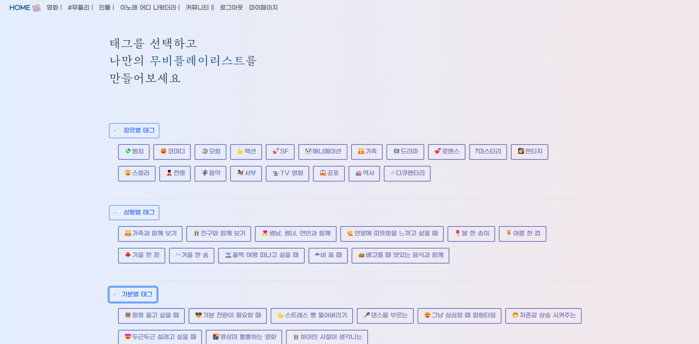

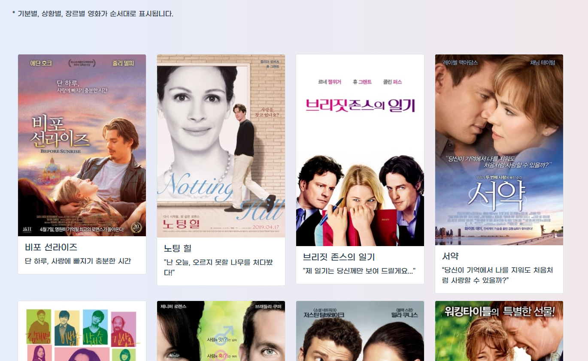

### 인물 메뉴

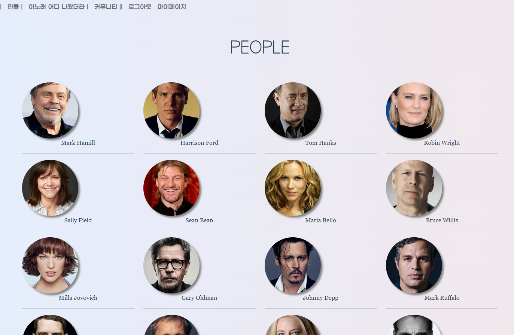

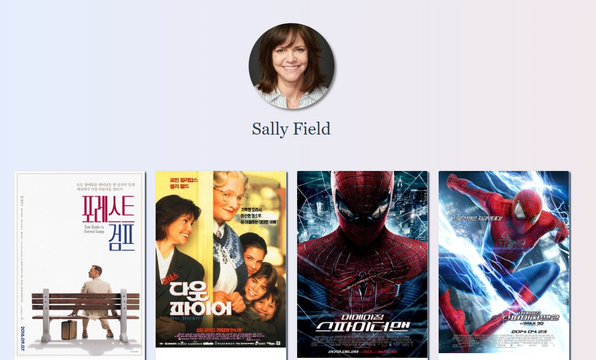

### 이 노래 어디 나왔더라

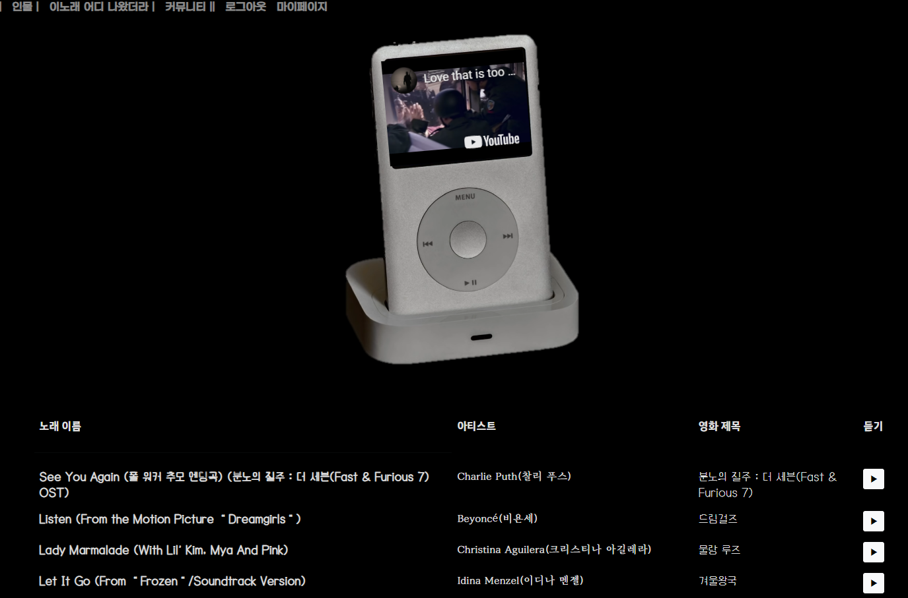

### 커뮤니티

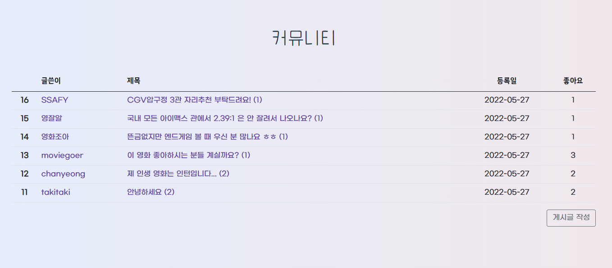

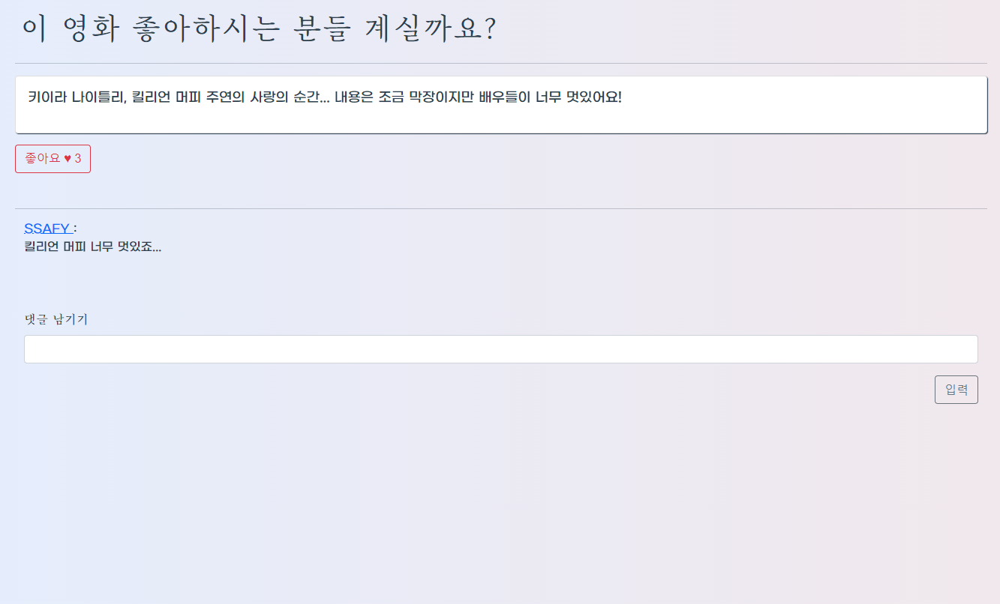

### 마이페이지

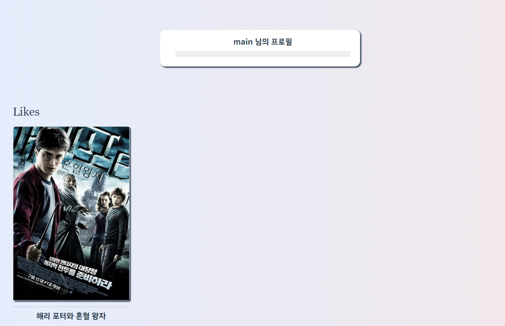

## 🪡 ERD

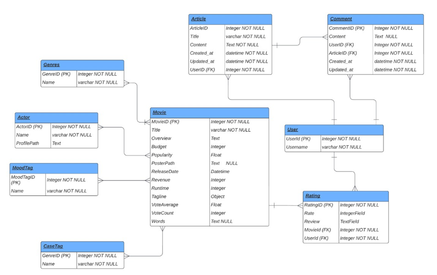

## 🎯 필수 기능

1. 사용자의 검색한 영화와 데이터 베이스 내 영화들의 키워드 유사도 방식을 통해 추천하는 알고리즘
2. 영화 검색 창에서 사용자가 오타를 입력해도 찾고자 하는 영화를 찾도록 문자열 알고리즘을 적용한 검색창
3. OST 목록을 보여주고 원하는 OST 재생
4. 장르, 기분, 상황 별 태그를 선택했을 때 그에 맞는 무비 플레이 리스트 제공
5. 배우 목록과 배우의 필모그래피를 제공해주는 기능
6. 사용자들 간의 커뮤니케이션이 가능한 게시글
7. 기본적인 회원가입, 로그인, 로그아웃

## 👍 느낀 점

김찬영 - 데이터 수집 부터 ERD 설계, 추천 알고리즘 개발, 클라이언트에 요청에 맞도록 데이터를 보내주는 백엔드 역활을 처음부터 끝까지 해본 첫 프로젝트였다. 생각보다 쉽지 않았지만, 너무 재미있었다. 에러를 만나고 해결하는 과정에서 DB가 어떤 식으로 움직이는지, API를 설계할 때 ERD가 얼마나 중요한지, 특히 REST 하다는 느낌을 이해하기가 어려웠는데, 이번 기회를 통해 감을 잡은 것 같기도 하다. 그리고 내가 설계한대로 데이터가 움직이고 그것을 받아서 화면을 구성하는 웹 서비스의 전반적인 흐름을 겪어볼 수 있어서 특히나 좋았던 것 같다. 마지막으로 몇몇 생각나는 기억들을 적어보면, 처음으로 내가 설계한대로 데이터가 화면으로 넘어가고 혜린이가 만든 vue를 통해 화면에 영화들이 나올 때,  브라우저에 토큰이 남아있다는 것을 생각하지 못하고 왜 계속 권한이 없다고 에러가 나오는지 몰라서 둘이 고생했던 것들이 생각이난다. 이 외에도 M:N 관계에서 `related_name` 설정, orm `annotate` 등 여러 에러들이 기억에 많이 남는 것 같다. 잘 정리해서 다음에는 금방금방 해결해야지!

김혜린 - BE와 소통하면서 데이터를 fetching하고, 그것을 사용자에게 언제, 어디서, 어떻게 보여줘야 하는지 치열하게 고민해야 하는 FE의 역할에 대해 배울 수 있었던 시간이었다. 작은 오타도 몇 시간을 들여서 찾기도 하고, 에러가 발생했을 때 이것이 FE단의 문제인가 BE단의 문제인가를 팀원과 함께 소통하면서 찾아내는 과정에서 개발하는 과정에서 원칙을 지키는 것과 협업하는 것의 중요성을 동시에 배울 수 있었던 소중한 시간이었던 것 같다. 또, 컴포넌트 구조를 설계하고, 그 위에 화면을 쌓아나가고, 최종적으로 사용자에게 보이게 될 사소한 부분들까지 디자인 하는 과정에서 직접 사용자와 만나게 되는 부분을 개발한다는 즐거움을 느낄 수 있었다. 나는 어떤 구조와 디자인의 웹사이트에서 만족을 느끼고, 그런 웹사이트들은 어떻게 개발되었을까를 공부해봐야 겠다는 다짐을 했었던 프로젝트였다. 프로젝트 결과적으로는 사용자가 영화에 대한 다양한 경험과 감성을 가져갈 수 있는 웹사이트를 만든 것 같아서 뿌듯하고, 프로젝트 기간이 마무리된 후에도 부가적인 기능과 보완 사항들을 발전시켜 나가고자 한다.

## notion

https://www.notion.so/hphk-edu/12-0815e92a9ced43bf88e55b0047c47bd0

## 🌵git branch convention

#### frontend/

프론트엔드 관련 기능 (ex: frontend/login)

#### backend/

백엔드 관련 기능 (ex: backend/fixture)

#### README

리드미 수정, 개발일지 작성

## 🖋️git commit message convention

#### 참고

https://blog.ull.im/engineering/2019/03/10/logs-on-git.html

#### Fix

> 올바르지 않은 동작을 고친 경우

#### Add

> 코드나 테스트, 예제, 문서 등의 추가가 있을 때

#### Remove

> 코드의 삭제가 있을 때

#### Refactor

> 전면 수정이 있을 때

#### Simplify

> 복잡한 코드를 단순화 할 때

#### Improve

> 향상이 있을 때(호환성, 테스트 커버리지, 성능, 접근성...)

#### Make

> 기존 동작의 변경을 명시

#### Implement

> 모듈, 클래스 등 구현체를 완성시켰을 때

#### Correct

> 문법의 오류나 타입의 변경, 이름 변경에 사용

#### Ensure

> 무엇인가 확실하게 보장받도록 할 때

#### Prevent

> 특정한 처리를 못하게 막을 때

#### Avoid

> 특정한 상황을 회피할 때

#### Move

> 코드의 이동이 있을 때

#### Rename

> 이름 변경이 있을 때

#### Allow

> 무언가를 허용할 때

#### Verify

> 검증 코드를 넣을 때

#### Set

> 변수 값을 변경하는 등 작은 수정

#### Pass

> 파라미터를 넘기는 처리를 할 때